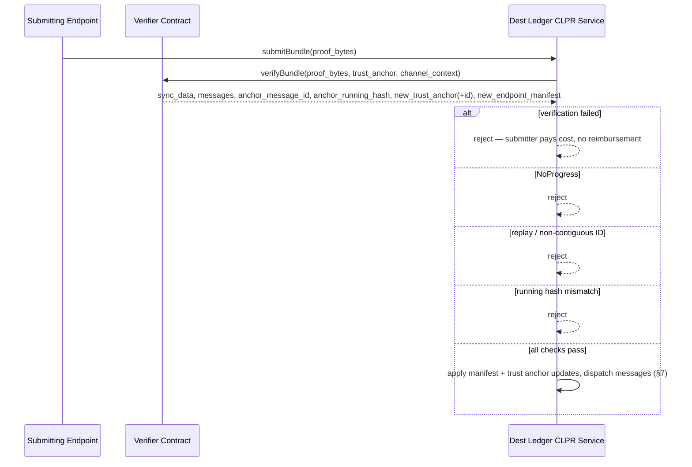
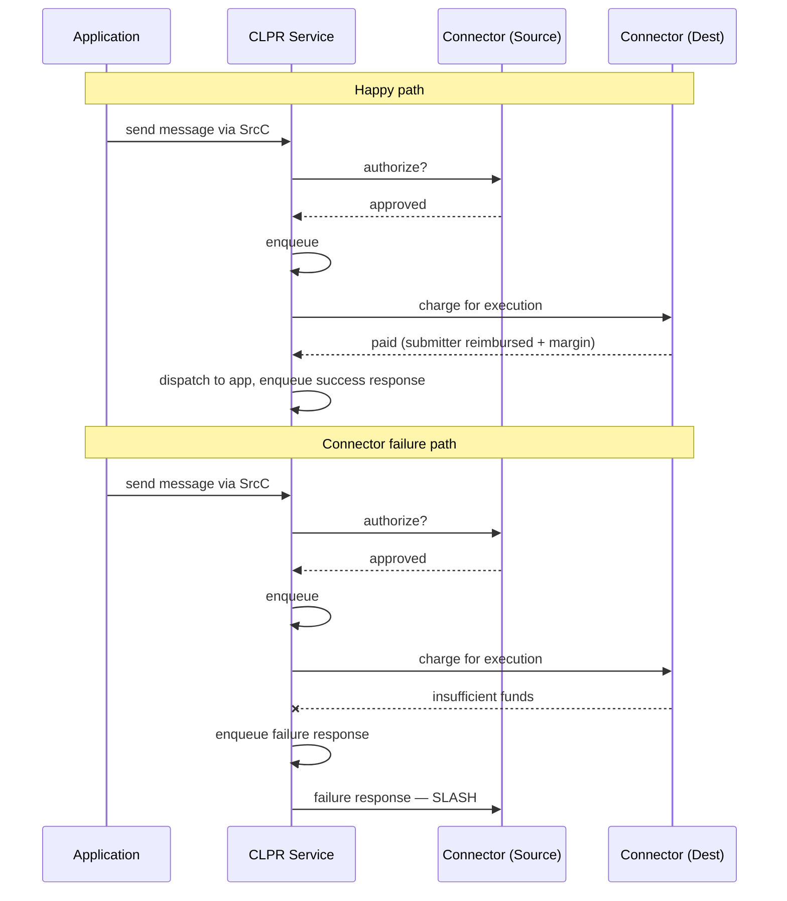

## Abstract

This HIP proposes CLPR ("Clipper"), a Cross Ledger Protocol that lets a Hiero network exchange arbitrary, ordered,
reliable messages directly with another ledger network — public or private — without an intermediary consensus
layer, bridge validator set, or new token. CLPR adds a native **CLPR Service** to Hiero that maintains per-peer
**Channels**, each backed by a pluggable **verifier contract** that authenticates state proofs from the peer ledger.
Messages travel in **bundles** relayed by permissionless **endpoints** (every Hiero consensus node is automatically
one) and are paid for by **Connectors** — economic actors who front execution cost on the destination ledger and are
slashed for non-payment. Because verification is delegated entirely to pluggable verifier contracts, CLPR itself is
proof-system-agnostic and can connect Hiero to any ledger for which a verifier exists, while requiring no protocol
change when a new ledger type is added. When both sides of a Channel have ABFT finality, CLPR inherits that
finality; a Channel to a probabilistic-finality chain (e.g. Ethereum) carries the reorg risk implied by the
verifier's chosen commitment level. This HIP specifies the on-ledger state, transaction surface, wire protocol, and
economic mechanism needed for interoperable Hiero-side implementations.

## Motivation

Existing interledger solutions typically introduce an intermediary trust layer — a federated bridge, an external
validator set, or a wrapped-asset custodian — to move value or messages between chains. That layer becomes the
weakest link: its keys can be stolen, its validators can collude, and its guarantees are usually weaker than the
finality guarantees of either chain it connects. Hiero, in particular, provides ABFT consensus with instant,
mathematically final consensus timestamps; any interledger mechanism that routes through a weaker intermediary
throws that guarantee away for cross-ledger interactions.

Hiero networks — public Hedera and private/permissioned "HashSphere" deployments alike — increasingly need to
interoperate with each other and with non-Hiero ledgers (Ethereum and other EVM chains, Cosmos/CometBFT chains,
QBFT/IBFT enterprise chains) for asset movement, oracle data, and cross-chain application logic. Today, teams
building these integrations either accept a weaker-trust bridge or hand-roll a bespoke, unaudited relay for each
ledger pair. Neither is acceptable for production financial workloads.

CLPR addresses this by having each ledger verify cryptographic proofs of the other's committed state directly,
using only the two ledgers' own consensus and finality guarantees. Concretely, CLPR:

- **Preserves ABFT guarantees.** If both networks are ABFT, cross-ledger message delivery inherits ABFT properties;
  no new trust assumption is introduced.
- **Eliminates intermediary trust.** There is no bridge validator set or federation. Verification is delegated to a
  verifier contract chosen and evaluated by the parties who bear the economic risk of using a given Channel.
- **Requires no new token.** All payments and penalties are denominated in each ledger's native token.
- **Is proof-system-agnostic and extensible.** Adding a new peer ledger type requires only a new verifier contract —
  no change to the CLPR protocol, the CLPR Service, or any existing deployment.
- **Supports both public and private topologies**, letting a private Hiero network (HashSphere) interoperate with
  public Hedera or with public non-Hiero chains without exposing its own network infrastructure.

## Rationale

**Proof-system-agnostic verification.** CLPR itself never inspects proof bytes; it delegates entirely to a
`IClprVerifier` implementation chosen by the Channel's creator ([Specification §5](#5-verifier-contracts)). This was
chosen over baking a specific proof system (e.g., a single ZK circuit, or Hiero-TSS-only verification) into the
protocol, because doing so would prevent Hiero from ever connecting to a chain with a different finality/signature
model without a protocol change. The cost of this generality is that a Channel's actual security depends on the
verifier deployed for it, and CLPR does not — cannot — certify verifier correctness. This tradeoff is made explicit
in [Security Implications](#security-implications): applications and Connector Operators must evaluate a Channel's
verifier before using it.

**Permissionless Channels and Connectors, curated endpoints.** Channel and Connector registration require no
admin approval — anyone who deploys a verifier can register a Channel, and anyone can become a Connector by posting
funds and stake. This mirrors how DeFi protocols are typically deployed and avoids making the CLPR Service Admin a
gatekeeper for economic activity. Endpoint admission is the one place CLPR *does* require curation: on
permissionless ledgers, unrestricted endpoint registration would let a Sybil flood the relay layer. On Hiero this is
moot — the consensus roster already is the endpoint set.

**Economics denominated in native tokens, no protocol treasury.** An earlier design considered a dedicated CLPR
utility token to unify fees and slashing across heterogeneous ledgers. It was rejected: it would require every
Connector Operator and endpoint to acquire and hold a token with no independent utility, adds a governance surface
(who mints, who controls monetary policy), and provides no capability that native-token accounting does not already
provide, since Channel and Connector state is per-ledger. Instead, a message's cost is paid on the destination
ledger in the destination ledger's native token, and the account that submits a bundle is reimbursed (plus margin)
from the Connector's balance on that ledger — see [Specification §7](#7-payment-and-routing-layer).

**Commit-reveal registration instead of first-come-first-served.** Channel IDs and Connector IDs are chosen by
their registrant and must match across both ledgers. A naive "claim the ID you want" flow is subject to cross-chain
front-running: an observer of the claim transaction on ledger A could race to claim the same ID on ledger B first.
The two-phase commit-reveal scheme ([Specification §4.4](#44-establishing-and-updating-channels)) closes this
window by having the registrant commit to a hash of `(id, public_key)` on both ledgers before revealing either
value.

**Verifier immutability per Channel, with the ability to open a new Channel.** The verifier bound to a Channel
cannot be swapped after creation. An earlier alternative — allowing the CLPR Service Admin to upgrade a Channel's
verifier — was rejected because it would let a single admin action silently change what a Connector Operator or
application had already vetted and bonded funds against. Instead, an upgraded proof format or a compromised
verifier is handled by opening a *new* Channel and migrating (see the Proof Format Upgrade and Compromised Verifier
scenarios in [Specification §8.7](#87-cross-role-scenarios), and [Specification §9](#9-recovery-scenarios)).

**No confidentiality, by design.** CLPR provides integrity and authenticity of message payloads but stores them
in plaintext on both ledgers. Building confidentiality into the protocol was considered and rejected: on-chain
ciphertext still leaks metadata (size, timing, sender, Connector), and cross-ledger key management is an
application-specific problem CLPR cannot solve generically. Applications that need confidentiality encrypt at the
application layer.

## User stories

- As an **End User** of a cross-ledger application (e.g., a cross-chain swap), I want my transfer between Hedera and
  another network to complete with the same finality guarantee I get for an ordinary Hedera transaction, so that I
  do not have to trust a bridge operator with my funds.
- As an **Application Developer**, I want to call a single Hiero service to send an arbitrary payload to a
  contract or account on a peer ledger and receive an ordered, correlated response, so that I can build cross-ledger
  logic without implementing my own relay, proof verification, or replay defense.
- As a **Connector Operator**, I want to register a Connector on a Channel, post funds and stake, and be paid a
  margin for every message my counterpart's endpoint delivers, so that operating relay economics is profitable and
  my downside from misbehavior is capped by my own stake.
- As a **Verifier Developer**, I want to publish a `IClprVerifier` implementation for a specific source ledger's
  proof system, so that any Connector Operator can deploy it and register Channels against it without needing my
  ongoing involvement.
- As an **Endpoint Operator** on a non-Hiero permissionless ledger, I want a well-defined registration and bonding
  process so that I can start relaying bundles and be reimbursed for the transactions I submit.
- As a **CLPR Service Admin** on a Hiero network, I want the ability to close a compromised or malfunctioning
  Channel immediately, without having any ability to create Channels, register Connectors, or touch locked funds
  myself, so that emergency response does not require also granting economic control.

## Specification

This section specifies the Hiero-side CLPR Service: the on-ledger state it maintains, the transactions it exposes,
and the wire protocol its endpoints use to communicate with a peer ledger. Where the peer ledger is not Hiero (e.g.,
Ethereum, a QBFT enterprise chain), this HIP describes only the parts of the protocol that are ledger-agnostic;
peer-side implementation details (verifier contracts for non-Hiero chains, non-Hiero endpoint/CLPR Service
implementations) are maintained as independent specifications by the ecosystem building each integration and are
out of scope here. Reference verifier specifications for Hiero, Ethereum, QBFT, and Sei exist today.

### 1. Terminology

- **Peer Ledger** — the other ledger a Hiero network communicates with over CLPR.
- **State Proof** — a cryptographic proof that a specific piece of data exists in a ledger's committed state and/or
  history. State proofs are CLPR's sole mechanism of cross-ledger trust.
- **Endpoint** — a node responsible for periodically exchanging configuration and messages with peer endpoints. On
  Hiero, every consensus node is automatically an endpoint.
- **CLPR Service** — the native Hiero service implementing this specification; the single source of truth for all
  CLPR state on a Hiero network.
- **Channel** — an on-ledger entity representing a communication path to a specific peer CLPR Service instance,
  bound to one verifier contract for its lifetime. Multiple Channels may exist between the same two ledgers.
- **Ledger Instance ID** — a verifier-derived, 32-byte identifier that binds a Channel to one particular ledger
  history and CLPR Service deployment. It is distinct from the human-readable `ChainID`, which is not unique.
- **Verifier Fingerprint** — the immutable content hash of the verifier executable plus, where applicable, the
  implementation and upgrade-authority commitments needed to describe its effective verification logic.
- **Connector** — an economic entity that authorizes messages on the source ledger and pays for their execution on
  the destination ledger.
- **Message** — an arbitrary byte payload plus routing metadata representing one unit of cross-ledger communication.
- **Bundle** — an ordered batch of messages transmitted together between two ledgers, accompanied by a state proof.
- **Data Message** — a message carrying application content. Every Data Message produces exactly one Response
  Message.
- **Response Message** — generated on the destination ledger after processing a Data Message; carries a status and
  reply bytes back to the source.
- **Control Message** — a protocol message that manages Channel state (e.g., configuration updates) rather than
  carrying application data.
- **Configuration** — a ledger's `ChainID`, protocol version, and throttle parameters, as published to peers.
- **Trust Anchor** — the opaque, verifier-defined representation of a peer ledger's current signing authority,
  stored per Channel and updated only via verified proofs.

### 2. High-level message flow

An application on the source ledger calls the CLPR Service to send a message, naming a Connector, a destination
Channel, and a target application. The Connector is asked whether it will authorize the message (implicitly
committing to pay for its own and its counterpart's obligations); if so, the message is enqueued in the Channel's
outbound queue. An endpoint on either side periodically opens a sync with a peer endpoint and exchanges a bundle of
not-yet-acknowledged messages, together with a state proof. The receiving endpoint submits the bundle as a native
transaction; post-consensus, the CLPR Service verifies the proof (via the Channel's verifier contract), verifies
replay/ordering/hash-chain integrity itself, charges the destination Connector, dispatches each Data Message to its
target application, and enqueues a Response Message. A later sync carries that response back to the source, which
matches it to the original Data Message and delivers it to the originating application.


### 3. Trust model

An application using a Channel implicitly trusts: (1) its own ledger's consensus; (2) the local CLPR Service
implementation; (3) the Channel's verifier contract, which validates all claims about the peer ledger; (4) the peer
ledger's consensus and CLPR Service implementation; and (5) the peer-side application. **Channel creation is
permissionless** — a Channel existing does not mean its peer is legitimate or its verifier is honest. Applications
and Connector Operators MUST independently evaluate a Channel's verifier contract before relying on it; the CLPR
Service performs no verifier certification.

Endpoint availability is a liveness, not a safety, property: state proofs prevent a dishonest endpoint from
fabricating messages, but availability requires at least one honest, reachable endpoint per side.

### 4. Network layer

#### 4.1 The CLPR Service

The CLPR Service is a native Hiero service, co-located with node software and stored in the Merkle state tree
alongside other Hiero state, making it directly provable via Hiero state proofs. It is the sole authority for and
custodian of:

- **Local configuration** — this Hiero network's `ChainID` and throttle parameters (one instance per CLPR Service).
- **Channels** — keyed by Channel ID; each holds the peer's `ChainID`, `LedgerInstanceID`, CLPR Service address and
  service code hash; its bound verifier contract and `VerifierFingerprint`; its current trust anchor; its own
  queue-tracking fields; and (via `ChannelSyncData`) the sync state exchanged with the peer.
- **Locked funds** — endpoint bonds and Connector balances/stakes.


#### 4.2 Ledger identity and configuration

Each participating ledger publishes a configuration with these fields:

| Field | Description |
|---|---|
| `ChainID` | [CAIP-2](https://github.com/ChainAgnostic/CAIPs/blob/main/CAIPs/caip-2.md) chain identifier (e.g., `hedera:mainnet`, `eip155:1`, `hashsphere:acme-prod`). Does **not** uniquely identify a ledger history or CLPR Service instance. Private/permissioned networks MAY self-assign an unregistered namespace. |
| `LedgerInstanceID` | Verifier-derived 32-byte commitment to the ledger history and the specific CLPR Service deployment. For a Hiero ledger this MUST commit to the ledger ID, the CLPR Service address, and the CLPR Service implementation hash. A non-Hiero verifier MUST define an equivalently collision-resistant derivation. |
| `ClprServiceCodeHash` | Immutable content hash of the peer CLPR Service implementation authenticated by the configuration proof. If the peer uses upgradeable indirection, this field MUST instead commit to the proxy, current implementation, and upgrade-authority policy as one verifier-defined value. |
| `Protocol Version` | Non-negative integer identifying the CLPR wire-protocol revision. Implementations MUST reject configurations with an unrecognized version; both Channel sides MUST run the same version. |
| `Timestamp` | Consensus time of the last configuration update; monotonically increasing. |
| `Throttles` | Capacity limits, below. |

Throttle fields, all published as part of the configuration and enforced as noted:

- `MaxMessagesPerBundle` — hard cap on messages per bundle this ledger will accept.
- `MaxMessagePayloadBytes` — max single-message payload size this ledger accepts on receipt. The **source**
  ledger MUST reject enqueuing any message exceeding the destination's advertised limit; the **destination**
  MUST reject any bundle containing an over-limit message regardless of what the source allowed.
- `MaxGasPerMessage` — computation budget cap for processing a single message.
- `MaxSyncBytes` — max total bundle-exchange payload size this ledger accepts from a peer endpoint. MUST exceed
  `MaxMessagePayloadBytes` plus protocol overhead for a single message, or the Channel can deadlock.
- `MaxQueueDepth` — max unacknowledged outbound messages per Channel; provides backpressure.
- `PendingClaimLifetime` — maximum consensus-time duration for an incomplete Channel or Connector commitment.
  Expired commitments are permissionlessly deletable and their identifiers become reusable.
- `MaxLocalEndpoints` / `MaxPeerEndpoints` — cap on this ledger's own live endpoint manifest, and on the number of
  peer endpoints cached per Channel (oldest-first truncation if the peer manifest is larger).

Implementations MUST reject any submission that violates a published limit and MUST NOT silently ignore
unrecognized fields or message types — CLPR is a strict protocol. Repeated, attributable limit violations by a peer
MAY count toward local misbehavior thresholds (§4.6).

> A `ChainID` can be claimed by anyone. Applications MUST identify a peer by the complete authenticated tuple
> `(ChainID, LedgerInstanceID, ClprServiceAddress, ClprServiceCodeHash)`, not by `ChainID` alone, and MUST
> independently verify that the selected Channel corresponds to their intended peer.

#### 4.3 Endpoint manifest

Each CLPR Service maintains a local `ClprEndpointManifest` (its own live endpoint set) and, per Channel, a cached
copy of the peer's manifest. A manifest holds an ordered list of `ClprEndpoint` entries, a monotonically increasing
`version`, and the owning CLPR Service's address. Each `ClprEndpoint` carries an optional service address (may be
omitted for endpoints that only initiate outbound syncs — useful for private networks that do not want to expose
network infrastructure) and a DER-encoded, self-signed ECDSA P-384 X.509 CA certificate (≤ 512 bytes; minimal DN,
no revocation/path-building extensions) that roots the endpoint's mTLS trust. Endpoints present a per-process
Ed25519 leaf certificate signed by this CA at every handshake; the leaf is never itself published and rotates on
restart or a configurable expiry (default 86400s).

On Hiero, the manifest is derived automatically from the active consensus roster: node identity changes update and
version-bump the manifest; weight-only changes do not. No manual administration is possible or required, and a node
removed from the roster by governance is automatically removed from the manifest.

The manifest is publicly queryable via `getEndpointManifest()`, and — because CLPR Service state lives in Hiero's
Merkle state tree — a state proof of the result is directly constructable by anyone. Channel creators obtain this
proof to seed a Channel's initial peer manifest (§4.4); endpoints embed an updated manifest proof in a subsequent
bundle whenever they observe the peer's manifest version has advanced, and the receiving CLPR Service atomically
adopts it if the proven version exceeds its stored version. A manifest-update bundle needs no messages and no
existing endpoint connectivity to submit — this is the mechanism that recovers a Channel after complete endpoint
turnover on one or both sides (see recovery scenarios R1, R3, R4, R9 in §9).

#### 4.4 Establishing and updating Channels

Channel creation is **permissionless** and uses a two-phase **commit-reveal** scheme to prevent cross-ledger
front-running of a chosen Channel ID:

```mermaid
sequenceDiagram
    participant User as Any User (Caller)
    participant LB as Ledger B (CLPR Service)
    participant LA as Ledger A (CLPR Service)

    Note over User,LA: Precondition: verifiers deployed on both ledgers; config proofs obtained from each peer

    rect rgb(240, 248, 255)
    Note over User,LA: Phase 1 — Claim
    User->>LB: registerChannel(ownership_commitment)
    LB->>LB: create Channel in PENDING with commitment
    User->>LA: registerChannel(ownership_commitment)
    LA->>LA: create Channel in PENDING with commitment
    end

    rect rgb(255, 248, 240)
    Note over User,LA: Phase 2 — Reveal
    User->>LB: completeChannel(channel_id, public_key, signature, verifier, config_proof, manifest_proof)
    LB->>LB: verify commitment + signature + verifier + peer config/manifest → ACTIVE
    User->>LA: completeChannel(...)
    LA->>LA: verify → ACTIVE
    end

    Note over User,LA: Both sides ACTIVE — syncing may begin
```

A Channel ID is 32 bytes, chosen by the registrant and identical on both ledgers. Before registering, the creator
obtains authenticated configurations for both peers and orders their `LedgerInstanceID` values lexicographically as
`instance_lo` and `instance_hi`. The creator generates a keypair and a uniformly random 32-byte salt, then computes:

```text
ownership_commitment = keccak256(
    "CLPR_CHANNEL_V1" ||
    instance_lo ||
    instance_hi ||
    channel_id ||
    public_key ||
    salt
)
```

`registerChannel` accepts only this commitment, revealing neither the Channel ID, key, salt, nor peer identities.
Pending state is keyed by the commitment rather than the submitting account. Re-registering the same commitment is
idempotent, and any caller may complete it by presenting a valid preimage and owner signature. Consequently, copying
an observed commitment cannot transfer ownership or block its legitimate completion. A pending commitment that is
not completed within `PendingClaimLifetime` is permissionlessly deletable.

`completeChannel` reveals `(channel_id, public_key, signature, salt,
verifier_contract, config_proof_bytes, endpoint_manifest_proof_bytes)`; the CLPR Service checks the commitment
preimage and a domain-separated signature over the complete revealed registration, calls the verifier's
`verifyConfig` to obtain the peer's verified configuration, `LedgerInstanceID`, CLPR Service code hash, initial
trust anchor, and initial endpoint manifest, records the local verifier fingerprint, and transitions the Channel to
`ACTIVE`. The signature scheme
(secp256k1 or Ed25519, extensible) is platform-specific but the same keypair works on both ledgers.

Multiple Channels MAY exist between the same two ledgers, keyed independently by Channel ID — e.g., one Channel per
commitment level a probabilistic-finality peer supports (`latest`/`safe`/`finalized`), each with its own verifier,
queue, and risk profile.

**Channel lifecycle.** A Channel has seven states:

| State | Meaning |
|---|---|
| `PENDING` | Claimed (commit phase) but not revealed. No messaging. Admin MAY delete via `closeChannel`; after `PendingClaimLifetime`, anyone MAY delete it (no drain needed). |
| `ACTIVE` | Normal operation: enqueue, sync, and process. |
| `PAUSED` | Auto-triggered by an inbound response-ordering violation (§7.5). No new outbound messages; inbound bundles with bad ordering are rejected outright; syncs continue. Auto-resumes to `ACTIVE` once the peer sends correctly ordered responses. |
| `QUARANTINED` | Terminal emergency state for a suspected verifier, peer service, or ledger-identity compromise. No new messages, bundle verification, acknowledgement advancement, application dispatch, or graceful draining is permitted. Query and application-specific reconciliation operations remain available. |
| `CLOSING` | Admin called `closeChannel`, or the peer reports `status ∈ {CLOSING, DRAINED, CLOSED}`. No new locally-originated Data Messages; all inbound messages still dispatched and responded to normally. |
| `DRAINED` | All of this side's Data Messages have been delivered and acknowledged. Inbound bundles still accepted (peer may still be draining). |
| `CLOSED` | Terminal. All processing and syncing for this Channel stops. |

A verified peer status of `QUARANTINED` immediately moves the local Channel to `QUARANTINED`; it MUST NOT be
treated as a request for graceful closing or draining.

Only the **CLPR Service Admin** may call `closeChannel`, valid from `PENDING` (immediate deletion), `ACTIVE`,
`PAUSED`, and `DRAINED` (immediate `CLOSED`, since the outbound queue is already fully acknowledged). From `ACTIVE`
or `PAUSED` it begins a graceful drain to `CLOSING`; in-flight messages complete normally. A Channel has no
per-Channel admin — the registrant keypair's only role is coordinating the commit-reveal and has no further
protocol authority.

Only the CLPR Service Admin may call `quarantineChannel`, valid from `ACTIVE`, `PAUSED`, `CLOSING`, or `DRAINED`.
Quarantine takes effect immediately and is not a graceful close: messages that have not already completed MUST be
reported as `UNRESOLVED` and MUST NOT be dispatched through the suspected verifier. `QUARANTINED` cannot transition
back to `ACTIVE`; recovery requires a new Channel. The quarantined service continues publishing its own Channel
status in provable state so that a peer can adopt `QUARANTINED` after verifying a status-only proof, but it does not
verify inbound proofs on the quarantined Channel.

**The verifier bound to a Channel is immutable**; a proof-format upgrade or a compromised verifier is handled by
opening a new Channel (§8.7, §9).

### 5. Verifier contracts

CLPR is proof-system-agnostic: all cryptographic verification of peer-ledger state is delegated to a **verifier
contract** bound to a Channel at creation and fixed for its lifetime. A verifier implements:

- **`verifyConfig(config_proof_bytes, channel_id, endpoint_manifest_proof_bytes) → (ChannelContext, chain_id,
  ledger_instance_id, peer_service_code_hash, peer_config, throttles, initial_trust_anchor,
  initial_trust_anchor_id, endpoint_manifest)`** — called once, at
  channel completion, to authenticate the peer's configuration and seed the Channel's initial trust anchor and peer
  manifest. `ChannelContext` MUST domain-separate every subsequent proof by `channel_id`, both ledger instance IDs,
  both CLPR Service addresses, the negotiated protocol version, and both service code hashes. The call MUST revert
  if the manifest's declared service address does not match the derived `ChannelContext`, if the manifest version is
  0, if a returned identity field is not authenticated by the proof, or if any cryptographic check fails. It MUST
  NOT revert solely because the manifest's endpoint list is empty.
- **`verifyBundle(bundle_payload, trust_anchor, ChannelContext) → (ChannelSyncData, messages[], anchor_message_id,
  anchor_running_hash, new_trust_anchor, new_trust_anchor_id, new_endpoint_manifest)`** — called on every bundle
  submission. Authenticates the proof against the Channel's *current* trust anchor and returns verified sync data,
  ordered messages, and optionally a successor trust anchor (a rotation) and/or an updated endpoint manifest.

What a verifier's proof bytes actually contain — Merkle paths, TSS/hinTS signatures, BLS aggregate signatures, or
any other scheme — is entirely its own concern; the CLPR Service never interprets them. Chain-specific verifier
specifications (Hiero TSS, Ethereum sync-committee BLS, QBFT quorum certificates, CometBFT/Sei validator sets) are
maintained independently.

At Channel completion, the CLPR Service MUST calculate and store the verifier fingerprint using a platform-defined
content-hash operation. If the verifier can delegate through a proxy or other mutable indirection, the fingerprint
MUST also commit to the resolved implementation and upgrade-authority policy. The service MUST expose the fingerprint
through its Channel query API and emit it in the Channel-completion record. A composite verifier MAY implement the
same interface and require several independently implemented proof checks; its fingerprint commits to the complete
composition and threshold policy.

**Trust anchor.** Every Channel holds an opaque `trust_anchor` representing the peer's current signing authority,
seeded by `verifyConfig` and updated only by a `verifyBundle` return value — never by an admin key or a
`ConfigUpdate` Control Message. A rotation travels *inside* the bundle proof and is applied atomically, before any
message in that bundle is processed, so a rotation and the messages it authenticates commit together. A verifier
MUST revert rather than return a `new_trust_anchor` whose succession was not itself state-proven within the same
call, preventing anchor injection by a compromised endpoint. Verifiers for proof systems with frequent, predictable
rotation (e.g., Ethereum's ~27-hour sync committee) SHOULD use a *window* encoding (multiple concurrently valid
authorities) rather than a *single-authority* encoding, decoupling relay timing from the exact rotation boundary.

**Finality and reorg risk.** For a peer without instant finality, the commitment level a verifier accepts (e.g.
Ethereum `latest` vs. `safe` vs. `finalized`) determines reorg exposure and is entirely the verifier's choice, not a
protocol parameter. Channels intended for high-value or irreversible operations should use a verifier that only
accepts finalized commitments. Hiero peers carry no such risk under honest supermajority.

**Adding a new peer ledger type requires no CLPR protocol change** — only a new verifier contract implementing this
interface, published for evaluation, and a Channel registered against it.

### 6. Messaging layer

#### 6.1 Queue and message model

Each Channel carries a single ordered queue of three message kinds — Data, Response, and Control — sharing one
running-hash chain, one state-proof mechanism, and one bundle transport. Two groups of bookkeeping fields track
queue state:

*Local only, never state-proven:* `acked_message_id` (highest outgoing message ID the peer has confirmed),
`sent_running_hash`, `received_running_hash`.

*Exchanged via `ChannelSyncData` on every sync, and state-proven:* `next_message_id` (next outgoing sequence
number), `received_message_id` (highest message ID received from the peer), and `status` (this side's Channel
status — the mechanism by which lifecycle transitions propagate to the peer).

Each queued entry carries a payload — a Data Message (routing metadata plus opaque bytes), a Response Message
(original message ID, structured status, opaque reply bytes), or a Control Message (currently only
`ConfigUpdate`, which is enqueued on every active Channel when the local admin changes configuration, giving total
ordering between config changes and application messages) — plus the cumulative running hash after that entry.
The running hash is `SHA-256(previous_running_hash ‖ serialized_payload)`, chosen for universal platform support
and adequate post-quantum preimage resistance; it is carried as opaque bytes so the algorithm can be upgraded via a
protocol version bump without a wire-format change. A receiver MUST reject an entire bundle containing a Control
Message variant it does not recognize, rather than skip it, to avoid divergent state.

#### 6.2 Bundle transport and progress

Messages travel only in bundles: an ordered batch of payloads plus a state proof anchored to the last message in
the batch. An endpoint compares the peer's reported progress against its own `next_message_id` to decide whether
there is anything to send, then reads the relevant range from message storage and constructs a proof over the
anchor message. The CLPR Service rejects any submitted bundle that satisfies **none** of these progress criteria
(the **NoProgress** check):

| # | Criterion |
|---|---|
| 1 | Anchor message ID > this side's stored `received_message_id` (new messages) |
| 2 | Verifier returns a `new_trust_anchor_id` different from the stored one (trust anchor advancement) |
| 3 | Verifier returns an endpoint manifest with version greater than the stored one |
| 4 | `sync_data.received_message_id` > stored `acked_message_id` (acknowledgement progress) |
| 5 | A valid Channel state transition is triggered (entering `CLOSING`, `DRAINED`, or `CLOSED`) |

A bundle carrying no application messages but a valid trust-anchor rotation or manifest update is valid and
satisfies the check on that basis alone (§5, §4.3).

When a Channel reaches `CLOSED` locally, the endpoint MUST submit one final **close-notification** bundle to the
peer, retrying until the peer accepts it (transitioning to `CLOSED`) or reports it is already `CLOSED`, before
ceasing sync activity for that Channel.

#### 6.3 Bundle verification

On receipt (post-consensus), the CLPR Service:

1. Calls the Channel's verifier with the proof bytes and current `trust_anchor`. A revert or verification failure
   rejects the whole bundle — the submitter bears the transaction cost.
2. Applies the NoProgress check (§6.2).
3. Atomically applies any returned endpoint manifest update, then any returned trust anchor rotation — both
   *before* processing any message in the bundle.
4. Enforces monotonic, contiguous message IDs strictly greater than the stored `received_message_id` — the
   authoritative replay defense, independent of and in addition to verifier correctness.
5. Recomputes the running hash chain from the stored `received_running_hash` and compares it to the verifier's
   returned `anchor_running_hash`; a mismatch rejects the bundle. This independently catches a *buggy* verifier
   (not a *compromised* one, which could fabricate a matching hash).
6. Only after all checks pass, dispatches each message in order to the payment and routing layer (§7).



`MaxMessagesPerBundle`, `MaxMessagePayloadBytes`, and related throttles (§4.2) bound bundle size; on Hiero these
are enforced against operations-per-second so an oversized bundle is rejected at ingest, never mid-execution.

#### 6.4 Message lifecycle and response ordering

Because a destination processes each incoming message sequentially, Response Messages are generated in exactly the
order their originating Data Messages arrived, and each response carries its originating `message_id`. The source
ledger verifies this ordering itself: it retains sent Data Messages after acknowledgement (they are not deletable
on ack alone, unlike Response Messages) and, as each incoming response arrives, matches it against the oldest
unresponded Data Message in order, deleting the Data Message once matched.

If a peer delivers responses out of order, the source ledger's CLPR Service transitions the Channel to `PAUSED`
(§4.4) rather than slashing — a peer ledger cannot be slashed, only an individual endpoint or Connector can. The
Channel auto-resumes once the peer produces correctly ordered responses; no admin action is needed or available. A
bundle that merely fails verification (bad hash, replay, oversized payload) is simply rejected with no Channel
state change — `PAUSED` is reserved exclusively for response-ordering violations.

### 7. Payment and routing layer



#### 7.1 Connectors

A Connector is a distinct entity that authorizes messages on one ledger and pays for their execution on the other.
Creating one requires specifying the Channels it operates on, an initial balance (for paying execution when
receiving), a locked slashable stake, and an admin authority. A Connector must exist on *both* ledgers of a Channel
it uses. Registration uses the same commit-reveal scheme as Channels; the **Connector ID** is derived as
`keccak256(channel_id ‖ pub_key ‖ salt)`, making it identical on every ledger where the same keypair registers for
the same Channel and salt, with no explicit cross-chain address mapping required. Storage is keyed by
`(channel_id, connector_id)`, so registration is scoped per Channel — a squatter on one Channel cannot affect the
same operator's Connector on another.

#### 7.2 Sending a message

An application calls the CLPR Service specifying a Connector, destination Channel, and target application. The
named Connector is asked to authorize the message (it may enforce allow-lists, rate limits, or required payment);
if it declines, does not exist, or the caller cannot pay the enqueue transaction fee, the call reverts and only the
failed-attempt fee is paid. On approval, the message is enqueued tagged with the Connector's identity; there is no
additional protocol-level fee on the sending side. Approval is an implicit commitment by the source Connector that
its destination-side counterpart is funded to pay for execution there.

#### 7.3 Receiving, routing, and paying

Each dispatched message (§6.3) is handled by type:

- **Control Messages** are processed directly by the CLPR Service; no Connector, no application dispatch, no
  response.
- **Data Messages** resolve `connector_id` to a local Connector via the cross-chain `(channel_id, connector_id)`
  mapping. If funded, the Connector is charged the execution cost plus a margin, paid to the account that submitted
  the bundle (reimbursing the transaction fee it fronted); the message is then dispatched to the target
  application, and a Response Message (success or application error) is enqueued regardless of outcome. If the
  Connector is missing or underfunded, a deterministic failure response (`CONNECTOR_NOT_FOUND` /
  `CONNECTOR_UNDERFUNDED`) is generated instead, and the submitting account absorbs the cost — mitigated by
  slashing (§7.4). One message's failure never blocks processing of the rest of the bundle.
- **Response Messages** are delivered to the originating application and drive the ordering/cleanup logic of §6.4;
  the Connector is charged for delivery plus margin the same way, and its reply status determines whether the
  source Connector is slashed.

Applications MUST treat all cross-ledger payloads — messages and responses alike — as untrusted input; CLPR
guarantees authenticity and integrity of a payload's origin, never its semantic safety. Hiero-side implementations
that dispatch to contracts MUST apply reentrancy guards and update all Channel state before dispatch (checks-
effects-interactions), since dispatch hands control to arbitrary application code.

#### 7.4 Failure consequences and slashing

Only Connector-attributable failures — `CONNECTOR_NOT_FOUND` and `CONNECTOR_UNDERFUNDED` — trigger slashing;
`APPLICATION_ERROR` does not (the Connector paid; the application reverted), and `SUCCESS` carries no penalty. On
the **destination** side, an underfunded (but present) Connector's bond is slashed and the proceeds pay the
submitting account; an absent Connector leaves the submitter uncompensated (an acknowledged limitation — there is
no cross-chain payment to recover a nonexistent bond). On the **source** side, when the failure response returns,
the *source* Connector's stake is slashed and paid to the account that submitted the bundle carrying that response
— punitive, since the source Connector approved a message its counterpart could not back. Repeated failures MAY
escalate to eviction from the Channel with forfeiture of remaining stake.

Each side's Connector bond MUST be calibrated to the worst-case exposure it can create — the destination bond to
the maximum in-flight execution cost, the source stake to the maximum penalty exposure from failure responses —
or a minimally staked malicious Connector can extract more execution cost than any slash can recover. Concrete
minimum-bond parameters are implementation/deployment policy, not fixed by this specification.

Endpoint reimbursement occurs only on the receiving side of a bundle submission; there is no direct payment for
outbound relay work. Implementations SHOULD have endpoints prefer syncing with peers that reciprocate by supplying
messages, which naturally discourages free-riding without requiring protocol enforcement.

### 8. Roles and operations

| Role | Responsibility | Trust vetting performed | Economic exposure |
|---|---|---|---|
| **End User** | Uses applications built on CLPR | Vets the application | Bears application-level risk |
| **Application Developer** | Builds/deploys cross-ledger applications | Vets Channels and Connectors | Pays per-message fees to Connectors |
| **Connector Operator** | Funds/operates a Connector; often creates Channels | Vets verifier implementations | Posts balance and stake; subject to slashing |
| **Verifier Developer** | Builds/audits/publishes verifier contracts | Owns correctness of verification logic | None in-protocol |
| **Endpoint Operator** | Runs relay infrastructure | Trusts local CLPR Service and served Channels | Earns reimbursement margin; fronts tx costs |
| **CLPR Service Admin** | Governs a CLPR Service instance | Emergency authority only | None |

#### 8.1 End User

Interacts only through applications. Risks: application bugs, poor Channel/Connector choices by the application,
ambiguous outcomes from a Channel closing mid-flight, and finality risk if the Channel's verifier accepts
sub-finality proofs.

#### 8.2 Application Developer

Calls the message-send entry point with a `channel_id` and `connector_id`; treats both as configurable, not
hardcoded. Must monitor Connector health and Channel status over the application's lifetime, and be ready to
migrate to a new Channel if a verifier is deprecated. Must treat all cross-ledger payloads as untrusted input, and
encrypt at the application layer if confidentiality is required — CLPR stores payloads in plaintext.

#### 8.3 Connector Operator

Often also the Channel creator. Must keep balance ahead of pending execution costs (else `CONNECTOR_UNDERFUNDED`
and escalating slashing) and keep destination-side registration current (else `CONNECTOR_NOT_FOUND`). May enforce
application allow-lists/rate limits in its authorization logic. Removal is blocked while in-flight messages exist
against it.

#### 8.4 Verifier Developer

An off-chain role with no protocol identity: builds contracts conforming to `IClprVerifier` (§5). Typically ledger
implementors, Connector Operators with stake at risk, high-value application developers, or independent auditors.
Responds to a discovered vulnerability with a security advisory; has no on-chain remediation power itself — closing
affected Channels is the CLPR Service Admin's job.

#### 8.5 Endpoint Operator

On Hiero, automatic via the consensus roster — no registration. On permissionless non-Hiero ledgers, a two-step
`registerEndpoint` (posts a bond, pending state) / admin `addEndpoint` (admits to the live manifest) flow; a
pending registration can self-cancel via `removeEndpoint` for a full refund. Must pre-fund signing accounts, since
Connector-margin reimbursement is post-consensus and cannot cover the initial transaction cost. Bonds are never
slashed; misbehavior results in eviction with full bond refund.

#### 8.6 CLPR Service Admin

Power is broad but exclusively protective: it can adjust configuration/throttles, admit or evict endpoints, and
close Channels — it cannot create Channels, register Connectors, or touch locked funds. Closing is irreversible and
graceful (drains through `CLOSING`/`DRAINED` to `CLOSED`). The Admin has no in-protocol economic incentive, which is
an acknowledged gap between responsibility and motivation that governance around the role must address.

#### 8.7 Cross-role scenarios

**Setting up a new route:** a Verifier Developer publishes and audits a verifier → a Connector Operator deploys it,
registers the Channel on both ledgers, and registers as a Connector → an Application Developer integrates → End
Users use the application.

**Proof format upgrade:** source ledger announces an upgrade → a new verifier is published → a new Channel is
registered and Connectors re-register → applications migrate → the Admin closes the old Channel once migration
completes. The source ledger must keep the old format valid long enough for migration.

**Compromised verifier response:** advisory or anomaly issued → Admin immediately calls `quarantineChannel` on
affected Channels (no queue drain and no further proof verification) → applications mark incomplete messages
`UNRESOLVED` and reconcile under their own recovery rules → patched verifier published → new Channels registered →
applications migrate. The exposure window is bounded by time-to-quarantine and the Channel's application-level
value limits, not time-to-patch.

**Connector withdrawal under load:** operator stops authorizing new messages → applications switch Connectors or
notify users → already-enqueued messages complete normally → once drained, the operator recovers funds.

### 9. Recovery scenarios

| # | Scenario | Recovery |
|---|---|---|
| R1 | Peer rotated endpoints during a partition; local side knows none of the new ones | Any party submits a manifest-update bundle directly as an on-chain transaction — no gRPC connectivity to old endpoints required. |
| R2 | Source upgraded proof format; existing verifier can't read it | Register a new Channel with a compatible verifier; migrate; Admin closes the old Channel. |
| R3 | Endpoints rotated, format unchanged | Manifest-update bundle path (as R1). |
| R4 | Endpoints rotated **and** format changed | New Channel + new verifier + manifest-update bundle on the new Channel; Admin closes the old one. |
| R5 | Verifier, peer service identity, or proof implementation compromised | Admin immediately moves the Channel to `QUARANTINED`; no messages drain through the suspected verifier. Register a new Channel with a correct verifier and reconcile incomplete messages out of band. |
| R6 | Peer's queue state permanently corrupted (bad response ordering) | Channel auto-`PAUSED`; auto-resumes if the peer fixes ordering (may require a peer-side CLPR Service upgrade); Admin may still close a `PAUSED` Channel. |
| R7 | Temporary network partition, endpoints unchanged | Syncs resume automatically; monotonic IDs and the running hash verify integrity. No intervention. |
| R8 | Peer ledger entirely down | Messages queue to `MaxQueueDepth`, then backpressure; syncs resume from where they left off once the peer returns. |
| R9 | Both sides' endpoints rotate simultaneously | Either side submits a manifest-update bundle directly on-chain, breaking the mutual deadlock. |

R5 and R6 may leave in-flight messages `UNRESOLVED`, requiring application-level, out-of-band reconciliation; every
other scenario resolves fully within the protocol. Applications that perform irreversible actions MUST define that
reconciliation path before using a Channel.

### 10. Impact on Mirror Node

Mirror nodes MUST index CLPR Service state changes (Channel creation/state transitions, including quarantine,
the authenticated peer instance and verifier fingerprint, Connector
registration/balance/slashing events, and enqueued/dispatched messages) to support application-level auditing and
reconciliation, the same way they index other native Hiero services today. No new consensus-level query type is
required; CLPR state is ordinary Merkle state.

### 11. Impact on SDK

Hiero SDKs SHOULD add typed support for the CLPR Service transaction surface (`registerChannel`, `completeChannel`,
`closeChannel`, `quarantineChannel`, Connector registration, `sendMessage`, and the corresponding query APIs),
consistent with how SDKs wrap other native services. Channel queries MUST return the authenticated peer instance,
peer service code hash, verifier fingerprint, and lifecycle state so applications can enforce an expected security
configuration. Endpoint-to-endpoint gRPC sync traffic is a peer-to-peer protocol between node software, not an
SDK-facing surface.

## Backwards Compatibility

CLPR is an entirely new, opt-in service. It introduces no changes to existing HAPI transaction types, existing
account/token/contract semantics, or existing consensus behavior. Networks that do not enable the CLPR Service are
unaffected. Applications and users who do not use CLPR see no change. Because Channel and Connector participation
are both permissionless and opt-in, there is no migration required for existing Hiero users.

## Security Implications

- **Verifier compromise is the primary systemic risk.** CLPR's own checks (replay defense, running-hash
  verification) catch a *buggy* verifier but cannot catch a *compromised* one that fabricates internally-consistent
  data. Applications and Connector Operators bear responsibility for evaluating a Channel's stored verifier
  fingerprint, including whether it commits to mutable indirection and who controls any upgrade authority. On a
  suspected compromise, graceful draining is unsafe; the Channel must be quarantined before a replacement is
  created.
- **Permissionless Channel/Connector registration means existence implies nothing about legitimacy.** A Channel
  claiming to represent a given `ChainID`, or a Connector claiming adequate funding, must be independently verified
  by anyone relying on it. Applications must pin the complete authenticated ledger/service identity rather than a
  self-asserted `ChainID`.
- **Cross-domain replay and copied commitments.** Channel commitments bind both ledger instances, the Channel ID,
  owner key, salt, and protocol domain. Pending records are idempotent and completable by the owner proof rather than
  by the first submitting account, so copying a commitment cannot seize or indefinitely block it. Expiry bounds
  storage consumption from abandoned commitments.
- **No confidentiality.** All message and response payloads are stored in plaintext on both ledgers and are
  visible to validators, endpoints, and any state reader. Applications requiring confidentiality must encrypt at
  the application layer.
- **Untrusted payload content.** A malicious counterpart application can craft a payload or response designed to
  exploit the receiving application (reentrancy, integer overflow, unexpected state transitions). CLPR guarantees
  only that a payload was authentically produced by the peer and unmodified in transit — never its semantic safety.
- **Reorg risk on probabilistic-finality peers** is entirely a function of the verifier's chosen commitment level;
  this specification does not and cannot enforce a minimum commitment level on peers lacking ABFT finality.
- **Denial-of-service via queue monopolization.** A single Connector can authorize enough messages to fill a
  Channel's queue to `MaxQueueDepth`, blocking others. This is an open economic design issue (candidate mitigations:
  send-time escrow, per-Connector queue quotas, or priority pricing) that MUST be resolved by a deployment's
  Connector-onboarding and bonding policy before production use; see [Open Issues](#open-issues).
- **Free-riding on relay costs.** Endpoints are reimbursed only for receive-side submission, not for the work of
  constructing and transmitting outbound bundles, creating an incentive to relay in only one direction. Peer
  preference toward reciprocating endpoints is a mitigation, not a protocol-enforced guarantee.
- **Sybil resistance for endpoints on non-Hiero ledgers** relies on admin curation (nothing joins the live manifest
  without explicit `addEndpoint`) plus bond friction, not on a majority-attack cost calibrated per chain.

## How to Teach This

The role-based operational guides in [Specification §8](#8-roles-and-operations) are the primary teaching surface:
each of the six CLPR roles (End User, Application Developer, Connector Operator, Verifier Developer, Endpoint
Operator, CLPR Service Admin) has a self-contained description of what it does, what it must vet, and what its
exit path looks like. New integrators should start with the "Setting up a new route" cross-role scenario
(§8.7) and the recovery-scenario table (§9), which double as an integration and fault-tolerance test checklist. The
full reference specification carries additional
worked examples (bundle construction, response-ordering walk-throughs) useful for implementers building a CLPR
Service, endpoint, or verifier from scratch.

## Rejected Ideas

- **A dedicated CLPR protocol token** for fees, staking, and slashing across all participating ledgers, instead of
  native-token accounting per ledger. Rejected: it would force every participant to acquire and hold an
  otherwise-useless token, requires a governance/monetary-policy surface CLPR does not otherwise need, and provides
  no capability native-token accounting doesn't already provide.
- **Message redaction**, allowing a CLPR Service admin to redact previously enqueued but unacknowledged messages.
  Rejected because a redacted and an unredacted encoding of the same message are hash-equivalent under the running
  hash chain, and bundle submission is permissionless — a malicious submitter could independently redact or
  un-redact any not-yet-acknowledged message it had observed, with both substitutions verifying successfully. See
  ADR `2026-08-01-remove-message-redaction.md`.
- **Admin-swappable verifiers per Channel.** Rejected in favor of verifier immutability plus new-Channel migration,
  so that a Connector Operator's or application's evaluation of a Channel's trust properties cannot be silently
  invalidated by a later admin action.
- **State-proving every message directly**, dropping the running hash chain entirely. Rejected on cost grounds:
  state-proving every message rather than only the bundle's anchor message would substantially increase
  computation and storage cost on both ledgers for no additional integrity guarantee, since the running hash chain
  already ties every message to the one state-proven anchor.
- **Built-in payload encryption.** Rejected because on-chain ciphertext still leaks metadata (size, timing,
  sender, Connector identity) and cross-ledger key management is an application-specific problem this protocol
  cannot solve generically.

## Open Issues

- **Queue monopolization / DoS mitigation** — send-time escrow, per-Connector queue quotas, and priority pricing
  are all under consideration to prevent a single Connector from filling a Channel's queue to `MaxQueueDepth`; none
  has been selected. This must be resolved before production deployment.
- **Minimum Connector bond calibration** — the minimum stake/balance required on each side of a Channel to cover
  worst-case exposure is an unresolved, deployment-specific economic parameter, not fixed by this specification.
- **Wire encoding under review** — the reference specification currently uses protobuf for all CLPR wire types;
  XDR is under evaluation as a potentially more gas-efficient alternative for EVM-side implementations. This choice
  does not affect the Hiero-side specification in this HIP but may affect cross-ledger interoperability guidance.
- **Application-layer patterns** (remote smart contract calls, escrow/mint/burn asset bridging, N-ledger atomic
  swaps, native HTS asset management over CLPR) are outlined only at a high level in the reference specification
  and are expected to be specified individually as follow-on HIPs once concrete use cases are built.
- **Receive-side-only endpoint reimbursement** may under-incentivize relay on Channels that are structurally
  one-directional; no protocol-level fix is proposed beyond peer preference for reciprocating endpoints.
- **Application-level value controls** — the CLPR Service cannot infer economic value from opaque payload bytes.
  Asset-transfer applications therefore require typed envelopes, per-asset rate limits, and explicit reconciliation
  rules in a companion specification before they can safely authorize mint, release, or other irreversible value
  movement.

## References

- CAIP-2 Chain ID Specification: [ChainAgnostic/CAIPs](https://github.com/ChainAgnostic/CAIPs/blob/main/CAIPs/caip-2.md)
- [HIP-1: Hiero Improvement Proposal Process](https://hips.hedera.com/hip/hip-1)

## Copyright/license

This document is licensed under the Apache License, Version 2.0 —
see [LICENSE](../LICENSE) or <https://www.apache.org/licenses/LICENSE-2.0>.
